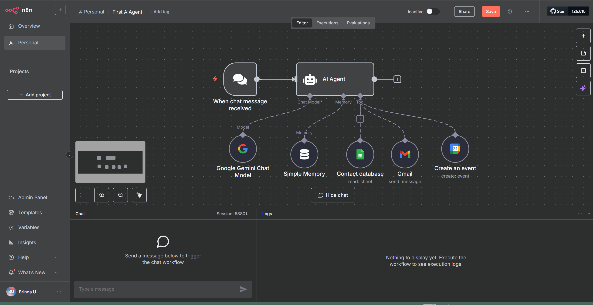

##  Smart Task Assistant (Built with n8n)

This AI-powered automation workflow leverages **n8n** and integrates multiple Google services to create an intelligent assistant that can **schedule meetings**, **send emails**, and **reference contact data** – all triggered from a simple chat message.

###  How It Works

The workflow is designed using **n8n’s visual editor** and consists of the following connected components:

* **Trigger:**

  *  `When chat message received`: This is the entry point of the workflow. Any incoming message initiates the flow.

* **AI Core:**

  *  **AI Agent** : This acts as the brain of the system.

    * **LLM Model**: Connected to the `Google Gemini Chat Model`, which interprets the user’s input and generates intelligent responses.
    * **Memory**: Integrated with `Simple Memory`, allowing the AI to retain context or past instructions using `DocMemory`.

* **Tools Used by the Agent:**

  *  `Contact database` (Google Sheets): Used to look up contact information when sending emails.
  *  `Gmail`: Sends out personalized messages based on input from the agent.
  *  `Google Calendar`: Automatically creates and schedules events based on the user’s request.

### ✨ Example Use Cases

* **Schedule Meetings:**

  * Just send a message like:
    *"Can you schedule a meeting at 8 AM tomorrow?"*
    The agent will automatically create a calendar event.

* **Send Emails:**

  * Say something like:
    *"Email all contacts about the project update."*
    The agent will look up the `Contact database` and use `Gmail` to send the messages.

* **Intelligent Workflow with Context:**

  * Thanks to the memory node, the agent can remember relevant details, enhancing its contextual understanding for more natural and human-like interactions.

###  Technologies & Tools

| Component         | Tool/Service Used          |
| ----------------- | -------------------------- |
| Automation Engine | [n8n](https://n8n.io)      |
| Language Model    | Google Gemini (Chat Model) |
| Memory Context    | Simple Memory (DocMemory)  |
| Contact Lookup    | Google Sheets              |
| Messaging         | Gmail                      |
| Scheduling        | Google Calendar            |

 Workflow Screenshot:
Here’s the visual structure of the agent workflow:

###  How to Set It Up

1. Open your n8n instance.
2. Import the `flow.json` from this repo.
3. Configure credentials:
   * Google Gemini API key
   * Google account access for Sheets, Gmail, and Calendar
4. Activate the workflow.
5. Start sending messages and let the AI agent handle the rest!

